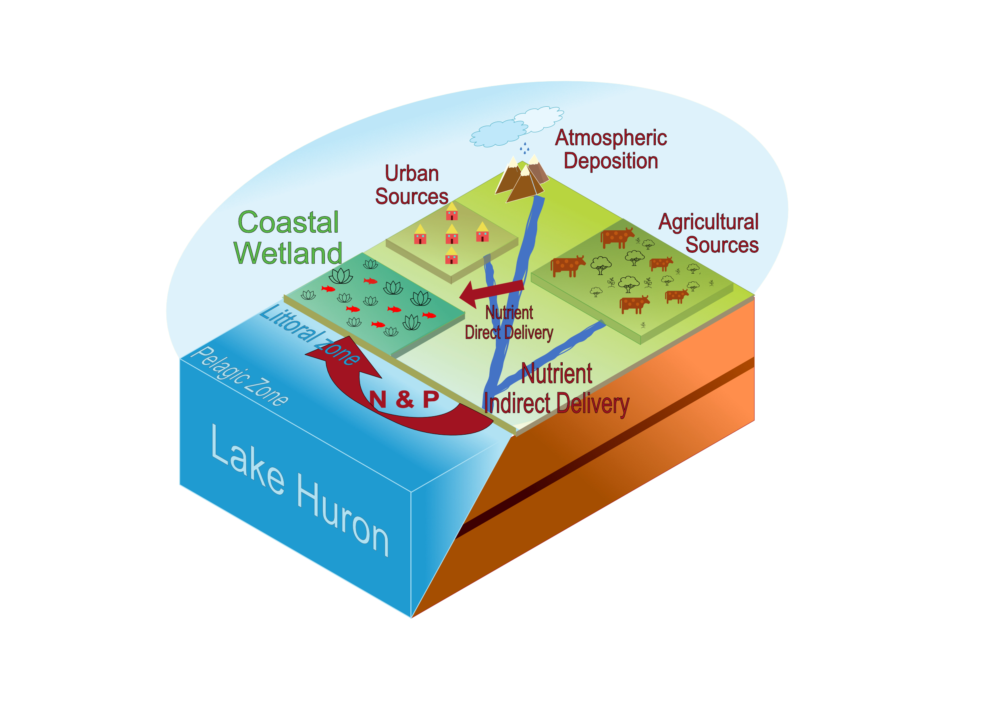

# Welcome to CoastalWetland Nutrient Flux estimation
## Introduction
Great lakes Coastal Wetlands are critical ecosystems that provide habitat to wildlife, reduce nutrient runoff to the lakes, and they also act as a major stopover along migratory corridors and prevent flooding.These critical environments are in danger of degradation due to either natural or human induced processes. Great Lakes coastal wetlands are an important and unique place/location to study coastal wetlands. One of the major stressor is nutrient runoff to coastal wetlands. Coastal wetlands receive nutrients either directly from land or indirectly from lake currents. Great Lake Huron has the longest shoreline among all Great lakes which provide a unique location to study Nutrient flux to coastal wetlands.and fill out this gap to know how much nutrients from lakes are returning to coastal areas. In this study we estimate Nutrient run off from land to coastal wetlands of Lake Huron using Senseflux. Also we will estimate the nutrient return to coastal wetlands from lakes using FVCOME and Pylag following is the github page to our workflow [Nutrietnflux](https://github.com/saminab/Nutrientflux_Project). Following is showing the concept map to estimate Direct and Indirect Nutrient flux to coastal wetlands 

