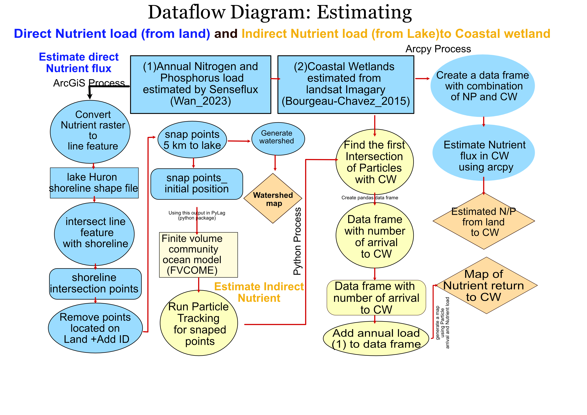

# Workflow
Following is showing the work flow of Estimating Nutrient flux in two major step: 1- Direct Nutrient Load 2- Indirect Nutrient Load you can see the workflow

# Nutrientflux_Project
# Nutrient Flux Project
This 
Following Directory is design to estimate Nutrient flux to Great Lake Huron 

The Processes are in two main environments:

## Indirect Nutrient load: 
This section calculates the nutrient load from the return of currents to coastal wetlands using particle tracking within currents generated by an open-water circulation model, part of NOAA's Great Lakes Coastal Wetland Forecasting System.
The process on this section was on Linux subsystem.

    1_Create_Initial_Position_multigroup.ipynb: This code generates position files within watersheds draining into the lake and assigns a number called group_id to identify the watersheds.
Following is demonstration the initial position of particles from Lake Huron's watershed 

    2_PT_senseflux_intersectpoint.ipynb: Uses particle tracking to identify the path of particles through currents.
Following is showing how we track the particles in couple month

    
    3_addgroup_number.ipynb: In addition to group_id, we need another identifier to track points within each watershed, as there are multiple points within each group_id. This code adds the group_number to the output of particle tracking.

    4_PT_FirstInteraction.ipynb: This code estimates how many particles intersect with the first coastal wetland.
Nutrient flux to coastal wetltands within one year 
    
     Nitrogen flux 

     Phosphoropus flux

## Direct Nutrient Load
This Directory encompass two main process.

    1- 1_Create_CoastalWatershed.ipynb: this code read the coastal wetlands that was obtained from MTRI team for 4 main Inundation, and Great lakes streams shapefile 

    2- 2_ZonalStats.ipynb: This code uses arcpy to estimated Direct nutrient load to stream watershed and coastal watershed within different water level condition

